# Architecture

> A complete reference of how the **five components** of StellarEarn — the Frontend, the Backend, the Soroban Smart Contract, the Subgraph event indexer, and the Database — fit together, exchange data, and ship to production.

This document has two halves:

1. **How the system works end-to-end** (top of this file) — the cross-component topology, request lifecycle, event vocabulary, data ownership, deployment topology, and current-state caveats.
2. **How the backend is wired internally** (lower half, preserved from the original `docs/ARCHITECTURE.md`) — the NestJS module graph, entity ER diagram, reputation system flow, sequence diagrams, module responsibilities table, common layer, event-driven architecture, security layers, scalability, and observability.

Both halves are intended to be readable independently; the cross-component half is the recommended starting point for new contributors.

---

## Table of Contents

- [1. What StellarEarn is](#1-what-stellarearn-is)
- [2. The 5 components](#2-the-5-components)
- [3. System topology](#3-system-topology)
- [4. The quest lifecycle, end-to-end](#4-the-quest-lifecycle-end-to-end)
- [5. Data ownership — who is the source of truth](#5-data-ownership--who-is-the-source-of-truth)
- [6. Event taxonomy (Contract → Subgraph → Frontend)](#6-event-taxonomy-contract--subgraph--frontend)
- [7. Backend module dependency graph](#7-backend-module-dependency-graph)
- [8. Deployment / runtime topology](#8-deployment--runtime-topology)
- [9. Current-state caveats](#9-current-state-caveats)
- [10. Where to read more](#10-where-to-read-more)
- [11. NestJS module architecture (preserved)](#11-nestjs-module-architecture-preserved)
- [12. Entity relationships (preserved)](#12-entity-relationships-preserved)
- [13. Reputation system architecture (preserved)](#13-reputation-system-architecture-preserved)
- [14. Module data flow (preserved)](#14-module-data-flow-preserved)
- [15. Module responsibilities (preserved)](#15-module-responsibilities-preserved)
- [16. Common layer (preserved)](#16-common-layer-preserved)
- [17. Event-driven architecture (preserved)](#17-event-driven-architecture-preserved)
- [18. Security architecture (preserved)](#18-security-architecture-preserved)
- [19. Scalability, monitoring & observability (preserved)](#19-scalability-monitoring--observability-preserved)

---

## 1. What StellarEarn is

**StellarEarn** is a *quest-based earning platform* on Stellar / Soroban. Teams create quests (a task + reward + verifier), contributors submit proofs of completion, verifiers approve them, and rewards are paid out — partly on-chain via a Soroban smart contract, partly through a backend "payouts" ledger that mirrors chain settlement.

Five components collaborate to make this work. Each one has a non-trivial responsibility that would be expensive to host in any of the others:

| # | Component | What it owns | Why it exists |
|---|---|---|---|
| 1 | **Frontend** *(Next.js 14 App Router, Vercel)* | UX, wallet integration, optimistic UI, client-side caching | Give a human a usable surface for quests, submissions, rewards |
| 2 | **Backend** *(NestJS, Docker)* | Business logic, off-chain persistence, authorization, event bus, scheduled jobs | Orchestrate the system; enforce rate limits, moderation, quotas, and RBAC |
| 3 | **Smart Contract** *(Soroban / Rust, on-chain)* | Authoritative quest state, escrow, payment, reputation, pause, upgrade | Be the trust-minimized source of truth for value movement |
| 4 | **Subgraph** *(TypeScript indexer, The Graph–style)* | Mirrors on-chain events into a queryable GraphQL API | Light up frontends with fast historical queries without paying RPC costs |
| 5 | **Database** *(PostgreSQL + Redis, Docker)* | Off-chain entities, event store, audit, caches, jobs, feature flags | Hold the things the contract can't economically store (free-form titles, audit, indexes) |

The next sections show exactly **how these pieces talk to each other**, **what data each owns**, and **what gaps the current code has**.

---

## 2. The 5 components

### 2.1 Frontend — `FrontEnd/my-app`

A Next.js 14 App Router application. State is managed in a local Zustand store; data fetching goes through a centralized Axios client (`lib/api/client.ts`) with JWT bearer auth, request retry, and SWR-style stale-while-revalidate caching. Wallet integration uses `@creit.tech/stellar-wallets-kit` (Freighter / Albedo / xBull).

**Key paths:**

- `app/[locale]/(quests|rewards|dashboard|profile|admin|notifications|settings)/...` — App Router pages, all locale-prefixed
- `lib/api/{quests,submissions,payouts,user,admin,...}.ts` — typed API clients + zod validation
- `lib/hooks/{useQuests,useClaim,useSubmission,useAuth,...}` — custom hooks that compose API + store
- `context/{WalletContext,AuthContext}.tsx` — global wallet / auth state
- `lib/store/slices/{questSlice,submissionSlice,...}.ts` — Zustand slices
- `components/quest/{QuestCard,QuestList,QuestWizard,...}` — feature components + a 5-step create wizard
- `components/rewards/{RewardsList,ClaimRewards,PendingRewards,ClaimButton,...}` — payout UX

**Speaks to:**

- Backend — REST over HTTPS, JWT bearer
- Contract directly — when the user signs a `claim` XDR on the client side (the `useClaim` flow bypasses the backend's mocked payout path)

### 2.2 Backend — `BackEnd`

A NestJS application with ⇆O 20+ feature modules. Persistence via TypeORM + PostgreSQL, secondary cache in Redis, scheduled jobs in BullMQ. Cross-cutting concerns (rate limit, throttler, feature flags, traces, metrics, sanitization) all live in `BackEnd/src/common/`.

**Key paths:**

- `src/modules/{quests,submissions,payouts,users,auth,webhooks,notifications,moderation,analytics,jobs,feature-flags,stellar,websocket,...}` — feature modules
- `src/events/{listeners,handlers,event-store,interfaces,dto}` — domain event bus + event-store persistence + DLQ
- `src/config/{stellar,cache,moderation,throttler,feature-flags,security,...}` — typed env-var config
- `src/database/{data-source.ts,migrations/}` — TypeORM DataSource + migrations
- `src/common/{guards,interceptors,pipes,decorators,filters,services,tracing}` — cross-cutting

**Speaks to:**

- Frontend — REST/HTTPS (controllers in each module)
- Contract — `@stellar/stellar-sdk` (`StellarService.signAndSubmit`) and `SorobanQuestReaderService` (read-only contract simulation) and Horizon REST for ledger confirmations
- Database — TypeORM repos + raw SQL migrations
- Subgraph — **does not call directly**; they share authoritative state via the chain + their separate indexes
- Redis — caching layer + BullMQ job store
- Sentry — error tracking
- OTel — distributed tracing

### 2.3 Smart Contract — `Contract_archived/earn-quest/` *(canonical Rust)*

A `#![no_std]` Soroban contract compiled to Wasm. It implements the quest lifecycle: register → submit proof → approve/reject (with escrow payout + reputation grant on approval) → expire/cancel/pause/upgrade. Lifecycle emissions drive the subgraph.

**Key paths:**

- `src/lib.rs` — public contract methods
- `src/quest.rs`, `src/submission.rs`, `src/payout.rs` — lifecycle
- `src/escrow.rs`, `src/reputation.rs` — value movement + XP
- `src/pausable.rs`, `src/admin.rs`, `src/upgrade.rs` — operations/safety
- `src/storage.rs`, `src/types.rs`, `src/errors.rs` — contract types
- `tests/` — 12 Rust test suites (unit + edge + property + integration + arithmetic safety)

**Speaks to:**

- Anyone with a Stellar secret + the contract ID — it's public on chain
- Backend — receives `submit_proof`, `approve_submission`, `register_quest`, `get_quest` (via simulations); emits events any indexer can subscribe to

### 2.4 Subgraph — `subgraph/`

A TypeScript listener + GraphQL server that mirrors on-chain events into a database and exposes them as GraphQL. Event topics are declared in `subgraph/src/config/topics.ts`; transformations live in `mappings/index.ts`.

**Key paths:**

- `src/storage/listener.ts` — Soroban event poller
- `src/mappings/index.ts` — event → entity
- `src/storage/database.ts` — entity persistence
- `src/api/server.ts`, `src/api/resolvers.ts` — GraphQL endpoint
- `schema/schema.graphql` — entity schema
- `Dockerfile`, `docker-compose.yml` — containerization, exposes :4000

**Speaks to:**

- Contract (RPC events)
- Its own Postgres (entity mirror)
- Frontend (GraphQL queries) — and indirectly the backend, which can query the same API

### 2.5 Database — Postgres + Redis

Two persistent services in `BackEnd/docker-compose.yml`. Postgres is the *primary* source of truth for off-chain state; Redis is the *secondary* cache and BullMQ job store.

**Postgres holds:**

- **Core entities** — `quest`, `submission`, `payout`, `user`, `notification`
- **Operations** — `event_store`, `poison_message`, `moderation_item`, `moderation_appeal`, `feature_flag`, `feature_flag_audit`
- **Multi-sig + escrow** — `multisig_wallet`, `multisig_signer`, `multisig_signature`, `multisig_transaction`, `quota_usage`, `quota_config`
- **Auth** — `refresh_token`, `two_factor`
- **Migration bookkeeping** — `typeorm_migrations`

**Redis holds:**

- Active ephemeral sessions (JWT refresh tokens)
- Cache-aside results for quests / payouts / users (`cache.config.ts` defines TTLs)
- BullMQ job queue state for the `jobs/` processors

---

## 3. System topology

The 5 components, the edges between them, and an at-a-glance view of which edge does what.

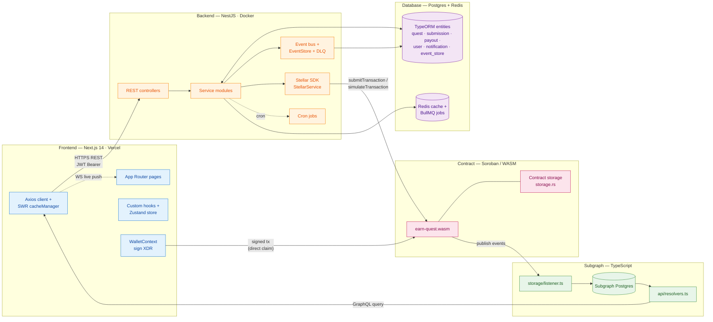

**Edge legend:**

- Solid black arrow: synchronous request-driven flow
- Solid gray dashed: scheduled / cron
- Dotted: event / pub-sub channel
- Double line (`A --- B`): tight-coupling (contract ↔ storage; ↔-↔: bidirectional)

---

## 4. The quest lifecycle, end-to-end

A single quest's life, traced from "admin creates it" through "user claims reward." This sequence shows the **intended** path — see [§9 Current-state caveats](#9-current-state-caveats) for the gaps currently observed in the source.

```mermaid
sequenceDiagram
    autonumber
    actor Admin
    actor Contributor
    actor Verifier
    participant FE as Frontend<br/>(Next.js)
    participant BE as Backend<br/>(NestJS)
    participant DB as Postgres
    participant Mod as Moderation +<br/>Quota
    participant Stellar as StellarService<br/>(stellar-sdk)
    participant Chain as Contract<br/>(earn-quest)
    participant Sub as Subgraph<br/>listener
    participant SG as Subgraph<br/>GraphQL
    participant Wallet as Wallet<br/>(Freighter)

    Note over Admin,Wallet: 1) Admin creates a quest (off-chain ledger first)
    Admin->>FE: POST /quests (admin wizard)
    FE->>BE: POST /api/v1/quests (JWT, ADMIN)
    BE->>Mod: enforceQuestCreationQuota<br/>scanText(title+body)
    Mod-->>BE: ok
    BE->>DB: INSERT quest row<br/>(status DRAFT/ACTIVE)
    BE-->>FE: 201 quest response

    Note over Contributor,Wallet: 2) Contributor submits proof
    Contributor->>FE: open quest, submit proof
    FE->>BE: POST /api/v1/quests/:id/submissions
    BE->>Chain: submit_proof(quest_id, submitter, proof_hash)
    Chain->>Chain: validate_quest_active<br/>(deadline, status, capacity)
    Chain->>Chain: storage::set_submission(Pending)
    Chain-->>BE: ok
    Chain-->>Sub: emit (proof_sub, quest_id, submitter)
    Sub->>SG: upsert Submission entity
    BE-->>FE: 201 submission

    Note over Verifier,Chain: 3) Verifier approves → on-chain payment
    Verifier->>FE: click Approve
    FE->>BE: POST /quests/:q/submissions/:s/approve
    BE->>DB: CAS UPDATE submission<br/>WHERE status=PENDING → APPROVED
    BE-->>FE: ok + emit 'submission.approved'
    Note right of BE: Today the contract<br/>call is commented out;<br/>intended path shown
    BE->>Stellar: tx = invoke(approve_submission(...))
    Stellar->>Chain: simulate + submit<br/>(signAndSubmit)
    Chain->>Chain: submission.status=Approved<br/>quest.total_claims += 1<br/>payout::process_payout<br/>reputation::award_xp(+100)<br/>status=Paid
    Chain-->>Sub: emit (approved, sub_paid)
    Sub->>SG: update entities
    Chain-->>Stellar: tx hash + ledger
    Stellar-->>BE: confirmed

    Note over Contributor,Wallet: 4) Contributor sees reward, claims (signed)
    FE->>SG: GET /graphql (rewards, payouts)
    SG-->>FE: paginated rewards + XP + level
    Contributor->>FE: ClaimRewards → useClaim
    FE->>Wallet: signTransaction(XDR)
    Wallet-->>FE: signed XDR
    FE->>Chain: submit signed tx
    Chain-->>FE: success
    Chain-->>Sub: ledger event
```

The same flow, contracted into a one-liner:

1. Admin creates → Postgres quest row + backend event
2. Submitter submits → on-chain submission + `(proof_sub)` event
3. Verifier approves → Postgres CAS update + (currently disabled) on-chain `approve_submission` ⇒ emits `(approved, sub_paid)` and pays escrow
4. Submitter claims ⇒ on-client signing ⇒ on-chain transfer ⇒ ledger event ⇒ subgraph updates ⇒ UI repaints

---

## 5. Data ownership — who is the source of truth

There are **two sources of truth** and a *mirror*. Getting this wrong is the most common bug class in this system — never assume the chain and the Postgres row are in sync without checking.

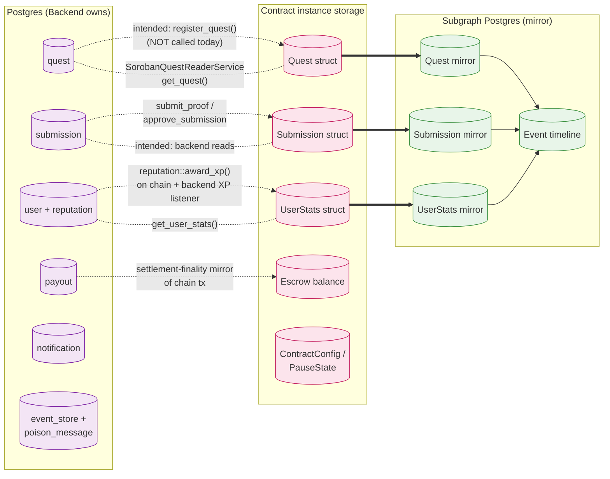

**Practical rule of thumb for contributors:**

- **Quest metadata** *(title, description, reward amounts in human display)* → Postgres. Chain holds only the canonical IDs and amount (`i128`).
- **Submission/proof status, lifecycle decisions** → chain is authoritative. Backend mirrors via backend event handlers.
- **Reputation / XP / badges** → dual-source: chain holds `UserStats` (canonical), backend mirrors via `UserExperienceListener`. Frontend primarily reads backend; on-chain reads are admin / audit only.
- **Payout completion / settlement** → *officially* chain-tx-bound, *in practice* tracked in `payout` Postgres row (the `PayoutsService.executeStellarPayment` is currently mocked in dev and throws in prod — see §9).

---

## 6. Event taxonomy (Contract → Subgraph → Frontend)

These are the topics the contract emits. Topics are wired in `subgraph/src/config/topics.ts`. New emitters/handlers should land both in `contract/.../lib.rs` and `subgraph/src/config/topics.ts` together.

```mermaid
flowchart LR
  classDef ct fill:#fce4ec,stroke:#c2185b
  classDef fe fill:#e3f2fd,stroke:#1976d2
  classDef sg fill:#e8f5e9,stroke:#388e3c

  subgraph E1[Contract emits]
    Q1[("quest_reg")]:::ct
    Q2[("status_upd")]:::ct
    Q3[("proof_sub")]:::ct
    Q4[("approved")]:::ct
    Q5[("rejected")]:::ct
    Q6[("sub_paid")]:::ct
    Q7[("quest_full")]:::ct
    Q8[("quest_exp / auto_exp")]:::ct
    Q9[("quest_can")]:::ct
    Q10[("emergency_wdr")]:::ct
  end

  Listener["subgraph/src/storage/listener.ts<br/>(polls RPC events)"]:::sg
  TopicMap["subgraph/src/config/topics.ts<br/>(topic → handler)"]:::sg
  Mappers["subgraph/src/mappings/index.ts<br/>(ScVal → entity)"]:::sg
  GQL["schema.graphql<br/>(Quest · Submission · UserStats · Payout · ...)"]:::sg
  Resolver["api/resolvers.ts"]:::sg

  Q1 & Q2 & Q3 & Q4 & Q5 & Q6 & Q7 & Q8 & Q9 & Q10 --> Listener
  Listener --> TopicMap
  TopicMap --> Mappers
  Mappers --> GQL
  GQL --> Resolver

  Resolver -- "GraphQL queries:<br/>getQuest(id)<br/>getSubmissions(questId)<br/>getUserStats(address)<br/>getRecentPayouts(addr)" --> FE_pages[Frontend pages:<br/>/rewards · /quests/[id] · /profile/[addr]]:::fe
```

The backend listens to a separate in-process event bus (`@nestjs/event-emitter`) described in §17 below; the contract bus and the backend bus are independent and emit different events. They share only the **domain vocabulary** (e.g. both have a "submission approved" event, but with different shapes).

---

## 7. Backend module dependency graph

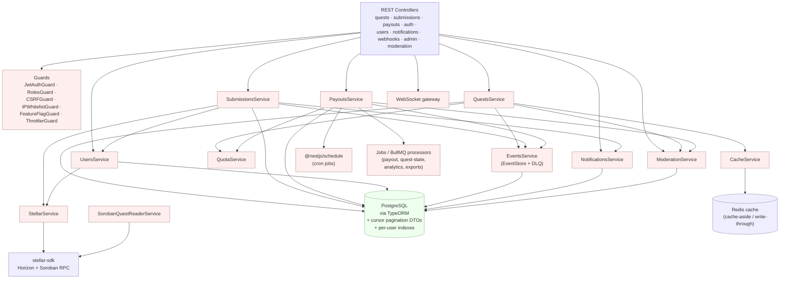

---

## 8. Deployment / runtime topology

Where each of the 5 components physically runs, the env vars they care about, and the contracts between them.

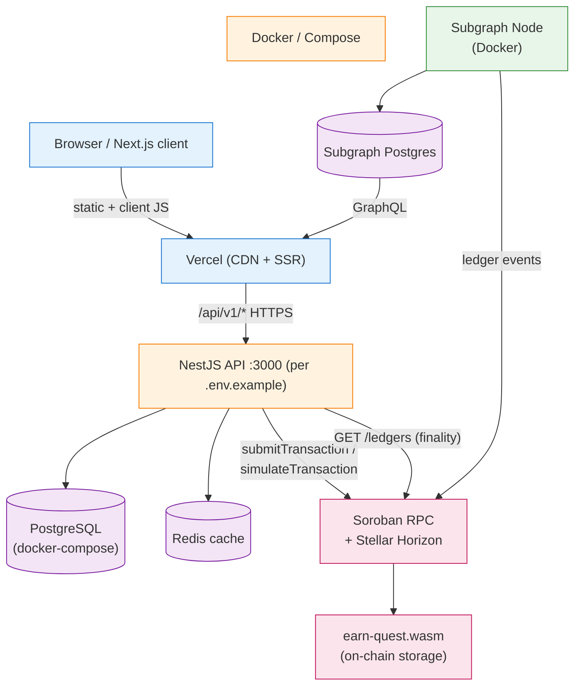

| Component | Runtime | Where it's hosted | Critical env vars |
|---|---|---|---|
| Frontend | Next.js 14 (Vercel default) | Vercel (or any Node SSR Node 22+) | `NEXT_PUBLIC_STELLAR_NETWORK`, `NEXT_PUBLIC_SOROBAN_RPC_URL`, `NEXT_PUBLIC_CONTRACT_ID`, `NEXT_PUBLIC_API_BASE_URL`, `NEXT_PUBLIC_SENTRY_DSN` |
| Backend | NestJS (Node ≥ 22) | Docker container (`BackEnd/Dockerfile`-equivalent) | `DATABASE_URL`, `JWT_SECRET`, `STELLAR_NETWORK`, `SOROBAN_RPC_URL`, `CONTRACT_ID`, `STELLAR_FINALITY_CONFIRMATIONS`, `CORS_ORIGINS`, per-endpoint `RATE_LIMIT_*_LIMIT/_TTL` |
| Contract | Soroban Wasm | Stellar (testnet/mainnet chosen at deploy) | `SOROBAN_SECRET_KEY`, `SOROBAN_RPC_URL`, `ADMIN_ADDRESS` |
| Subgraph | Node 20-slim | Docker (port 4000) | `CONTRACT_ID`, `RPC_URL`, `API_PORT` |
| Database | Postgres 15 + Redis 7 | `BackEnd/docker-compose.yml` | `DATABASE_URL`, `DB_POOL_MAX`, `DB_POOL_MIN` |

For full env-var parity validation run:

```bash
bash scripts/validate-env-parity.sh BackEnd/.env.example BackEnd/.env
bash scripts/validate-env-parity.sh FrontEnd/my-app/.env.example FrontEnd/my-app/.env.local
```

---

## 9. Current-state caveats

> These are gaps observed in the source as of this writing. They are noted so contributors don't model the system on intended behavior — the source has TODO spots that need filling before stated flows work end-to-end.

1. **Submissions controller is half-wired.**
   `BackEnd/src/modules/submissions/submissions.controller.ts` only exposes `GET /quests/:questId/submissions`. The `SubmissionsService` has `approveSubmission` / `rejectSubmission` logic and a commented-out `submitProof` pattern, but **there is no `POST /quests/:id/submissions` endpoint**, so submissions created via the chain today don't have a matching backend creation route.

2. **The on-chain approval call is commented out.**
   `SubmissionsService.approveSubmission` has the line `await this.stellarService.approveSubmission(...)` *commented out*. The intent is to call `StellarService.signAndSubmit` with the contract's `approve_submission` arguments. Until uncommented, the backend's approval flow stops at the Postgres CAS update + event emit.

3. **`executeStellarPayment` is mocked in dev / unimplemented in prod.**
   `PayoutsService.executeStellarPayment` returns `mock_tx_${now}_${id}` plus a random ledger in dev/test, and throws `Stellar payment not implemented for production` outside of those. The settlement-finality state machine, cron jobs, retry logic, and admin retry endpoint are all correctly modeled — only the actual Stellar SDK call needs wiring.

4. **The contract is in `Contract_archived/earn-quest/`.**
   The README and CODEOWNERS suggest a separate `Contract/` directory; the canonical Rust source currently lives under `Contract_archived/`. If you change the contract, update the canonical path.

5. **`scripts/migrate-contract-storage.mjs` does schema-version migration offline.**
   The tool reads `state.json` (exported from `soroban contract dump`), splits legacy `metadata → metadata_core + metadata_extended`, splits `escrow → escrow_balances + escrow_meta`, normalizes `platform_stats → platform_counters`, and bumps `schema_version: 1 → 2`. **No on-chain auto-migration** is wired — running it without first exporting state will silently drop fields.

6. **Frontend `NEXT_PUBLIC_API_BASE_URL` mismatches backend `.env`.**
   `FrontEnd/my-app/.env.example` shows `NEXT_PUBLIC_API_BASE_URL=http://localhost:3000`. `BackEnd/.env.example` sets `PORT=3000`. Some READMEs and Swagger screenshots reference `:3001`. Pick one and update both files — the `deploy-contract.sh` and `deploy.sh` orchestrators default to `$BACKEND_PORT=3001` for health checks, so be deliberate about the port choice.

7. **`Makefile` references `infra/docker-compose.yml` which doesn't exist.**
   `make db-up` and `make docker-up` point at `infra/docker-compose.yml`. The actual file is `BackEnd/docker-compose.yml`. Either add a symlink or update the Makefile.

8. **`pnpm-workspace.yaml` is incomplete.**
   The file currently only lists `allowBuilds:` overrides with placeholder strings like `set this to true or false`. It doesn't list any workspace packages and probably needs review.

9. **The `feature-flags` system is referenced by all guards but environments aren't seeded.**
   `FF_ENABLE_*` defaults to `false` for all flags in `.env.example`. Until a real rollout strategy lands, every feature flag-gated route will block new behavior.

---

## 10. Where to read more

- `BackEnd/ReadMe Backend.md` — NestJS quickstart, module list, env vars, deployment
- `FrontEnd/ReadMe Frontend.md` — Next.js quickstart, hooks, components, deployment
- `FrontEnd/my-app/README.md` — Next.js dev details, env validation, test commands
- `Contract_archived/earn-quest/README.md` — contract API, build/test/deploy
- `BackEnd/src/database/migrations/` — TypeORM migration history + `data-source.ts`
- `script-inventory.md` — repo-maintained scripts (deploy, audit, monitor)
- `docs/backend/data-flow.md` — backend-only data flow with module relationships
- `docs/FRONTEND_ARCHITECTURE.md` — frontend-only architecture
- `docs/Frontend disaster recovery runbook.md` — incident response
- `scripts/deploy/deploy.sh` — full-stack deploy orchestrator with `--contract-only` / `--backend-only` etc.

---

## 11. NestJS module architecture (preserved)

The original module-level architecture diagram and tables from the pre-existing `docs/ARCHITECTURE.md` are preserved below for reference. They focus on internal NestJS module wiring rather than the cross-component view above.

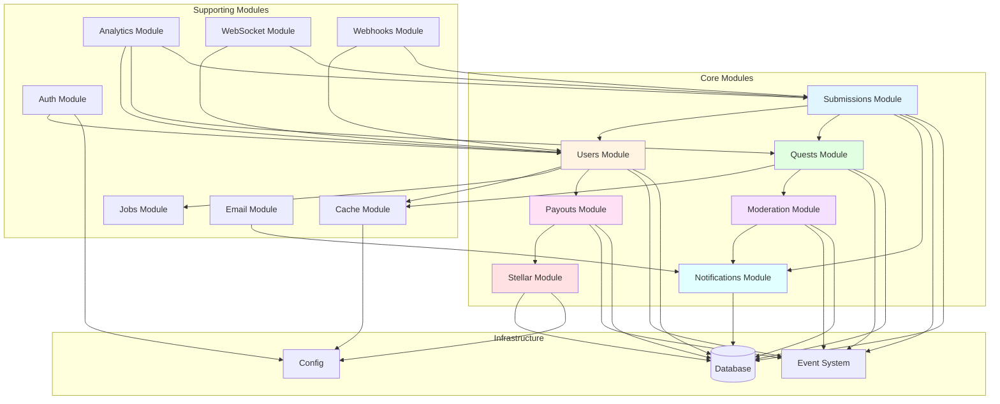

---

## 12. Entity relationships (preserved)

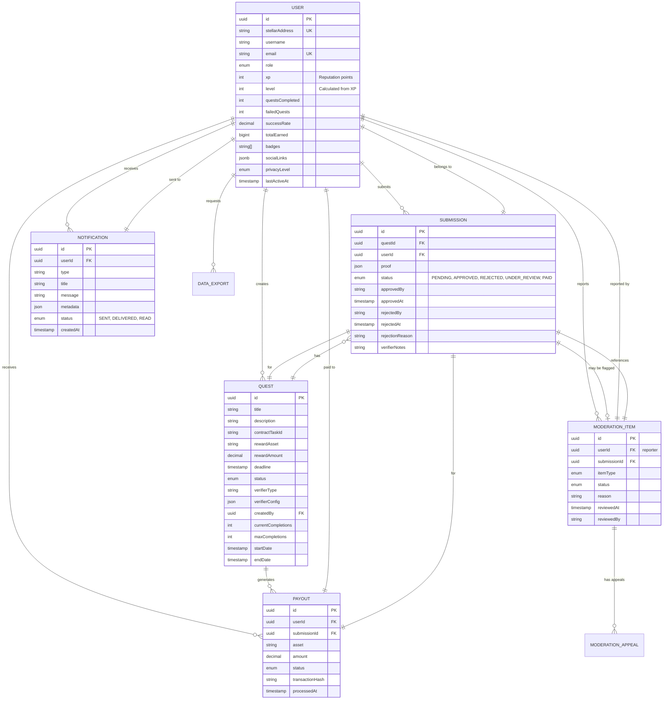

---

## 13. Reputation system architecture (preserved)

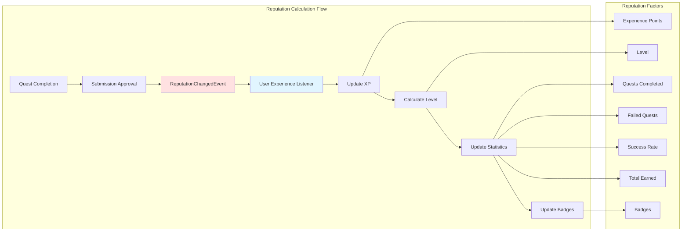

---

## 14. Module data flow (preserved)

### Submission Flow

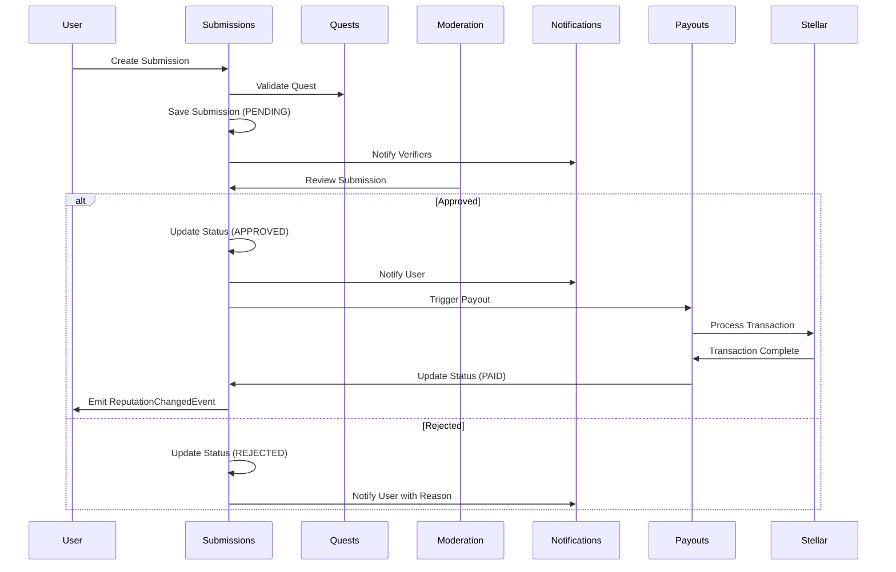

### User Reputation Flow

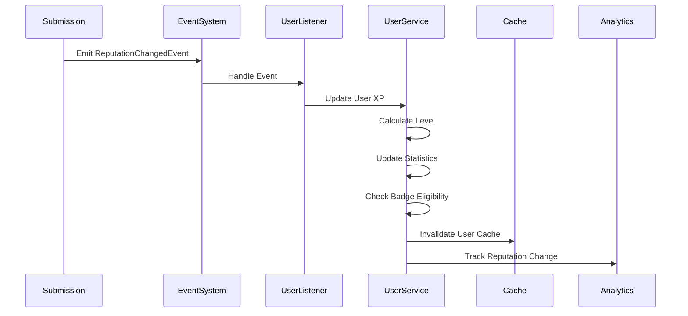

---

## 15. Module responsibilities (preserved)

### Core Modules

| Module            | Responsibility                                   | Key Entities                                           |
| ----------------- | ------------------------------------------------ | ------------------------------------------------------ |
| **Submissions**   | Manage quest submissions, verification workflow  | Submission, SubmissionStatus                           |
| **Users**         | User management, reputation system, gamification | User, DataExport, PrivacyLevel                         |
| **Quests**        | Quest creation, management, verification config  | Quest, QuestStatus                                     |
| **Payouts**       | Payment processing, Stellar integration          | Payout                                                 |
| **Moderation**    | Content moderation, appeals system               | ModerationItem, ModerationAppeal                       |
| **Notifications** | Multi-channel notification delivery              | Notification, NotificationLog, NotificationPreference  |
| **Stellar**       | Blockchain operations, multisig wallets          | MultisigWallet, MultisigTransaction, MultisigSignature |

### Supporting Modules

| Module        | Responsibility                             |
| ------------- | ------------------------------------------ |
| **Auth**      | Authentication, authorization, JWT tokens  |
| **Cache**     | Caching layer, cache strategies            |
| **Jobs**      | Background job processing, scheduled tasks |
| **Analytics** | Reporting, data aggregation, snapshots     |
| **Email**     | Email delivery, templates                  |
| **WebSocket** | Real-time communication                    |
| **Webhooks**  | External webhook delivery                  |

---

## 16. Common layer (preserved)

The common layer provides shared functionality across modules:

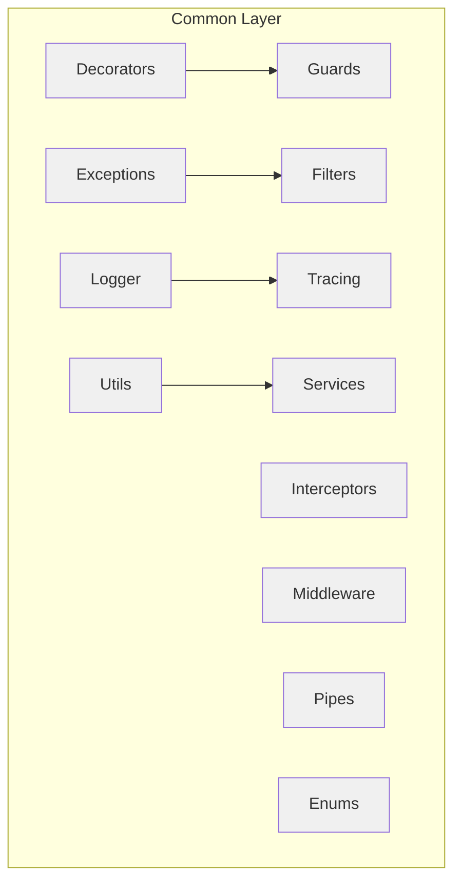

---

## 17. Event-driven architecture (preserved)

The system uses an event-driven architecture for decoupled communication:

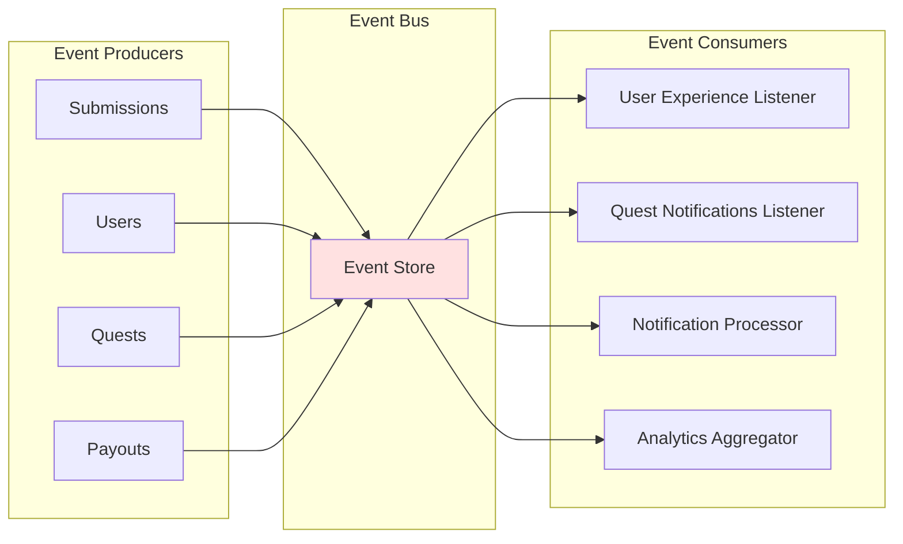

### Key Events

- **ReputationChangedEvent**: Fired when user reputation changes
- **QuestCreatedEvent**: Fired when a new quest is created
- **SubmissionStatusChangedEvent**: Fired when submission status changes
- **PayoutProcessedEvent**: Fired when a payout is completed

---

## 18. Security architecture (preserved)

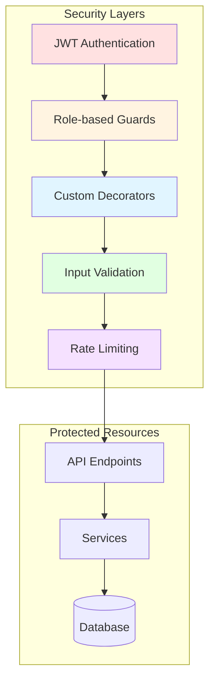

---

## 19. Scalability, monitoring & observability (preserved)

### Scalability Considerations

1. **Horizontal Scaling**: Stateless services allow horizontal scaling
2. **Caching**: Redis cache reduces database load
3. **Queue System**: Background jobs processed asynchronously
4. **Event-Driven**: Decoupled modules via event system
5. **Database Indexing**: Strategic indexes on frequently queried fields
6. **Pagination**: All list endpoints support pagination

### Monitoring & Observability

- **Logging**: Structured logging with Winston
- **Tracing**: Distributed tracing support
- **Health Checks**: Health module for monitoring
- **Analytics**: Analytics module for business metrics

---

*Maintained by the StellarEarn architecture group. Updates should keep §1–§10 (cross-component) and §11–§19 (NestJS-internal) in sync when modules or contracts change. Diagrams render natively in GitHub, GitLab, Notion, VS Code Markdown preview, and mermaid.live.*
