# Type Ownership Guidelines

**Status:** Active | **Owner:** Backend maintainers | **Applies to:** All new features touching data types

---

## Layer Overview

| Layer | Location | Purpose |
| --- | --- | --- |
| DTO | `BackEnd/src/modules/*/dto/` | API contract: request bodies, responses, validation rules |
| Domain | `BackEnd/src/modules/*/entities/` (backend) · `FrontEnd/my-app/lib/types/` (frontend) | Core business entities and logic |
| View Model | `FrontEnd/my-app/lib/view-models/` | UI-specific shapes with computed/formatted fields |

---

## Layer Definitions

### 1. DTO Layer

What the API accepts and returns. Shape and validation only — no business logic.

**Characteristics:**
- Defines structure, types, and validation constraints
- Used by class-validator pipes at controller boundaries
- Transforms external input into domain types
- Maps domain types to external output
- No methods, no computed properties, no business rules

**Ownership:** Backend team owns DTO definitions; frontend consumes via generated OpenAPI types.

```typescript
// BackEnd/src/modules/quests/dto/create-quest.dto.ts
export class CreateQuestDto {
  @IsString()
  @IsNotEmpty()
  title: string;

  @IsString()
  @IsOptional()
  description?: string;

  @IsNumber()
  @Min(1)
  rewardAmount: number;

  @IsDateString()
  deadline: string;

  @IsUUID()
  organizationId: string;
}
```

### 2. Domain Model Layer

The canonical representation of business entities. TypeORM entities on the backend; TypeScript interfaces on the frontend.

**Characteristics:**
- Single source of truth for entity structure
- Contains persistence metadata (backend only)
- Encapsulates business invariants and rules
- Shared across modules via the event bus
- Stable contract: changes require migrations

**Ownership:** Backend owns TypeORM entities; frontend owns corresponding TypeScript interfaces.

```typescript
// BackEnd/src/modules/quests/entities/quest.entity.ts
@Entity('quests')
export class Quest {
  @PrimaryGeneratedColumn('uuid')
  id: string;

  @Column()
  title: string;

  @Column({ nullable: true })
  description: string;

  @Column('decimal', { precision: 20, scale: 7 })
  rewardAmount: number;

  @Column()
  deadline: Date;

  @Column()
  status: QuestStatus;

  @ManyToOne(() => Organization)
  organization: Organization;

  isActive(): boolean {
    return this.status === QuestStatus.ACTIVE && this.deadline > new Date();
  }
}
```

```typescript
// FrontEnd/my-app/lib/types/quest.ts
export interface Quest {
  id: string;
  title: string;
  description: string | null;
  rewardAmount: number;
  deadline: string;
  status: QuestStatus;
  organizationId: string;
}
```

### 3. View Model Layer

UI-specific data shapes. Adds computed fields, formatting, and presentation logic.

**Characteristics:**
- Computed fields derived from domain data
- Formatting for display (dates, currency, status labels)
- UI state flags (isClaimed, canSubmit, daysRemaining)
- Never persisted; created in frontend lifecycle
- Multiple view models per domain entity allowed

**Ownership:** Frontend team owns view models; they adapt domain data for specific components.

```typescript
// FrontEnd/my-app/lib/view-models/quest-board-item.ts
export interface QuestBoardItem {
  id: string;
  title: string;
  description: string;
  rewardFormatted: string;
  deadlineRelative: string;
  statusLabel: string;
  isExpired: boolean;
  daysRemaining: number;
}
```

---

## Layer Mapping Flow

```mermaid
%%{init: {'theme':'base','themeVariables':{'background':'#ffffff','primaryColor':'#ffffff','primaryTextColor':'#000000','primaryBorderColor':'#000000','lineColor':'#000000','textColor':'#000000','secondaryColor':'#ffffff','secondaryTextColor':'#000000','secondaryBorderColor':'#000000','tertiaryColor':'#ffffff','tertiaryTextColor':'#000000','tertiaryBorderColor':'#000000','mainBkg':'#ffffff','nodeBorder':'#000000','nodeTextColor':'#000000','clusterBkg':'#ffffff','clusterBorder':'#000000','titleColor':'#000000','edgeLabelBackground':'#ffffff','actorBkg':'#ffffff','actorBorder':'#000000','actorTextColor':'#000000','actorLineColor':'#000000','signalColor':'#000000','signalTextColor':'#000000','labelBoxBkgColor':'#ffffff','labelBoxBorderColor':'#000000','labelTextColor':'#000000','loopTextColor':'#000000','noteBkgColor':'#ffffff','noteTextColor':'#000000','noteBorderColor':'#000000','sequenceNumberColor':'#ffffff'}}}%%
flowchart LR
  A[HTTP Request] --> B[DTO<br/>Validation]
  B --> C{Valid?}
  C -->|No| D[400 Error]
  C -->|Yes| E[Domain<br/>Entity]
  E --> F[Business Logic]
  F --> G[DTO Response]
  G --> H[Frontend<br/>Domain Type]
  H --> I[View Model<br/>Computed Fields]
  I --> J[UI Component]
```



---

## Rules at a Glance

| Rule | Description |
| --- | --- |
| One-way flow | DTO → Domain → View Model; never reverse |
| No business logic in DTOs | Validation only; computation belongs in domain or view model |
| Domain is authoritative | Database schema drives domain model changes |
| View models are ephemeral | Created in frontend, never persisted or sent to API |
| Multiple view models allowed | One domain entity may have many view models for different UI contexts |
| OpenAPI first | Generate frontend types from `/api/docs-json` |
| Explicit mapping required | Use mapping functions or factory patterns; never pass types across layers |

---

## When to Create a View Model

Create a view model when the UI needs:

- Computed fields (e.g., `daysRemaining`, `isExpired`)
- Formatted values (e.g., `rewardFormatted`, `deadlineRelative`)
- Presentation-specific state (e.g., `canSubmit`, `showClaimButton`)
- Aggregation of multiple domain entities (e.g., `QuestWithSubmissionStatus`)
- Localization or internationalization formatting

**Example:** A quest detail page needs more fields than a quest list item. Create separate view models for each context.

---

## Migration Checklist

When adding or modifying data types:

- [ ] Define or update the domain entity first (backend)
- [ ] Generate migration if database schema changes
- [ ] Create DTOs for new endpoints (backend)
- [ ] Add OpenAPI schema documentation
- [ ] Generate frontend types from updated OpenAPI spec
- [ ] Create view models as needed (frontend)
- [ ] Update any mapping functions or factories
- [ ] Run backend tests: `npm run test -- --path=modules/<module>`
- [ ] Run frontend tests: `npm run test -- --testPathPattern=view-models`
- [ ] Verify Swagger UI renders updated schemas correctly